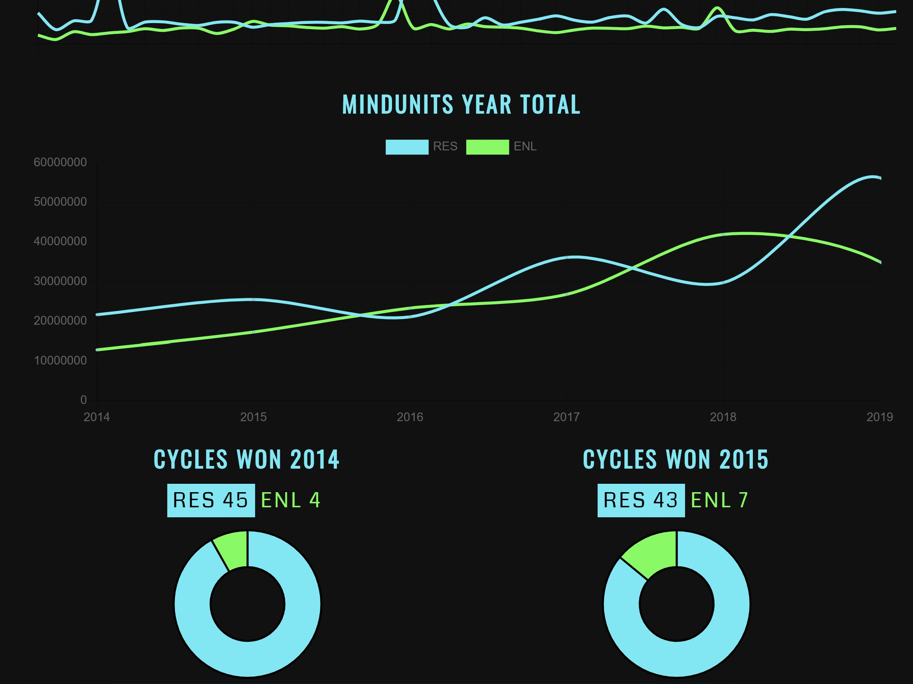

[](https://app.netlify.com/sites/ingress/deploys)

# 💏 Ingress Cycle History

### [ NR02-GOLF-04 ] - BERLIN



## [🌐 >SEE IT LIVE< ](https://ingress.netlify.app)

A simple React App that shows the Cycle History for a Cell.
The Data is provied by Agents for Agents. Take a lookt at `src/cycles`

All Data is stored in Markdown Files and can be edit by everyone.
Make a Pull Request to Add Data or Ping me [@geryy in Telegram](https://telegram.me/geryy)

## 💾 Data Structure

It's all Markdown. Example:

```markdown
---

cell: NR02-GOLF-04
cycleYear: 2014
cycle: 02
cycleDate: 2014-02
resistance: 231000
enlightened: 66000

---

Sitrep written in markdown goes here....
```

The Frontmatter contains all the Data needed for Gatsby to parse.
You can add as many fields you want but don't remove any.

## 🤖 Build with...

- GatsbyJS - a blazing fast modern site generator for React.
- Markdown
- Hosted on Netlify
- CMS: Netlify CMS

### Make it yours

This Project is Open Source and can be adopted by everone.
Fork it and add your own Data in `src/cycles`
